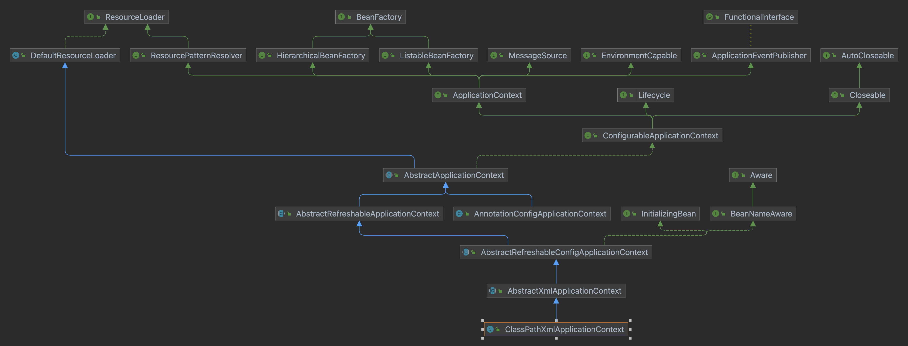
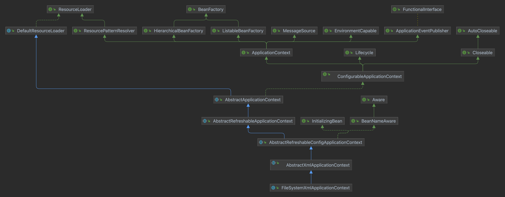
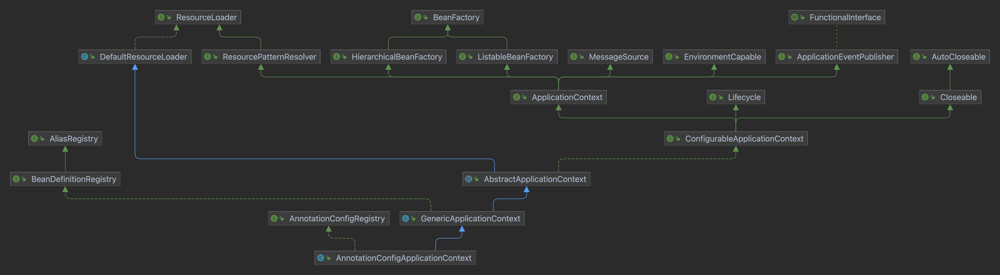

## 前言
* `IoC` - `IoC`就是控制反转，是一种思想，将对象创建交个`spring`管理，而`DI`（依赖注入）是一种具体的实现。

## 容器篇
### 概念
* `IoC容器` - `org.springframework.context.ApplicationContext`接口代表`Spring IoC`容器，负责`实例化`、`配置`和`组装bean`。容器通过读取`配置元数据`来获得关于要`实例化`、`配置`和`组装`哪些对象的指示。
* 配置元数据以`XML`、`Java注解`或`Java代码`表示。它可以让你表达构成你的应用程序的对象以及这些对象之间丰富的相互依赖关系。

### 快速入门
* 从`xml`配置文件创建`spring ioc`，`ClassPathXmlApplicationContext`
编写示例通过bean输出[spring-hello-world](https://github.com/mg0324/java-code/tree/main/spring-hello-world)。
* 可以使用[spring-initializr](https://start.spring.io/)来快速生成模板代码。

!> 通过xml配置方式来完成，后续可以通过注解配置方式完成。

<!-- tabs:start -->
#### **beans.xml 配置元数据**
放在`classpath`下
``` xml
<?xml version="1.0" encoding="UTF-8"?>
<beans xmlns="http://www.springframework.org/schema/beans"
       xmlns:xsi="http://www.w3.org/2001/XMLSchema-instance"
       xsi:schemaLocation="http://www.springframework.org/schema/beans http://www.springframework.org/schema/beans/spring-beans.xsd">
    <bean id="helloSpring" class="com.mango.HelloSpring"></bean>
</beans>
```
#### **HelloSpring.java 实例化的Bean**
``` java
package com.mango;

/**
 * hello spring
 *
 * @author mango
 * @since 2023/06/18
 */
public class HelloSpring {

    public void hello(){
        System.out.println("hello spring");
    }
}
```
#### **TestHelloSpring.java 使用容器**
使用`ClassPathXmlApplicationContext`实现类来加载配置文件。
``` java
package com.mango;

import org.springframework.context.ApplicationContext;
import org.springframework.context.support.ClassPathXmlApplicationContext;


/**
 * test hello spring
 *
 * @author mango
 * @since 2023/06/18
 */
public class TestHelloSpring {
    public static void main(String[] args) {
        ApplicationContext applicationContext = new ClassPathXmlApplicationContext("beans.xml");
        HelloSpring helloBean = (HelloSpring) applicationContext.getBean("helloSpring");
        helloBean.hello();
    }
}

/**
 * 打印：
 * hello spring
 */
```
<!-- tabs:end -->

### ApplicationContext的常见实现类
<!-- tabs:start -->
#### **ClassPathXmlApplicationContext**
配置文件需要在`classpath`下

#### **FileSystemXmlApplicationContext**
配置文件需要在`project root path`下

#### **AnnotationConfigApplicationContext**
指定配置类（带有`@Configration`注解的类)

<!-- tabs:end -->

## Bean篇
### 概念
* `Bean` - 一个`SpringIOC`容器中管理着一个或多个`Bean`，这些`Bean`是由定义的`配置元数据`创建的。
* `BeanDefinition` - `Bean`的配置元数据，定义构成`Bean`的一组属性，主要包括`全路径类名`、`行为方式`（`scope`、`生命周期回调`等）、`依赖`、`属性`等。

### BeanDefinition概述
在`Spring`框架中，`BeanDefinition`是一个用来描述`Spring容器`中的一个`Bean`的`元数据对象`。它包含了`Bean`的`类名`、`属性值`、`构造函数参数`、`依赖关系`等信息。

简单来说，`BeanDefinition`就是`Spring容器`中一个`Bean`的定义，它描述了这个Bean的所有信息。当`Spring容器`启动时，会读取`BeanDefinition`，根据其中的信息创建Bean实例，并将这些Bean实例纳入到容器中统一管理。

常用属性如下：
* beanClassName：Bean的类名。
* scope：Bean的作用域。Spring支持的Bean作用域包括singleton（单例）、prototype（原型）、request（请求）、session（会话）和global-session（全局会话）。
* constructorArgs：构造函数参数。
* propertyValues：属性值。
* autowireMode：自动装配模式。Spring支持的自动装配模式包括no（不自动装配）、byName（按名称自动装配）、byType（按类型自动装配）、constructor（构造函数自动装配）和autodetect（自动检测）。
* lazyInit：是否延迟初始化。
* dependsOn：Bean的依赖关系。
* initMethod：Bean的初始化方法。
* destroyMethod：Bean的销毁方法。

其他属性包括：
* factoryBeanName：如果Bean是由工厂Bean创建的，则该属性指定工厂Bean的名称。
* factoryMethodName：如果Bean是由工厂方法创建的，则该属性指定工厂方法的名称。
* parentBeanName：如果Bean是另一个Bean的子Bean，则该属性指定父Bean的名称。
* synthetic：如果Bean是Spring容器自动创建的，则该属性设置为true。
* primary：如果Bean是多个同类型Bean中的首选Bean，则该属性设置为true。

`BeanDefinition`可以通过`XML配置文件`、`Java注解`或者`Java代码`等方式进行定义。在Spring框架中，BeanDefinition是一个非常重要的概念，它为Spring容器提供了灵活的配置方式，使得开发者可以更加方便地管理Bean。

1. XML配置文件

``` xml
<bean id="myBean" class="com.example.MyBean">
  <property name="name" value="John Doe"/>
  <property name="age" value="20"/>
</bean>
```

2. Java注解

``` java
@Component
public class MyBean {

  @Value("John Doe")
  private String name;

  @Value("20")
  private int age;

}
```

3. Java代码

``` java
BeanDefinition beanDefinition = new BeanDefinition();
beanDefinition.setBeanClassName("com.example.MyBean");
beanDefinition.setScope("singleton");
beanDefinition.setLazyInit(false);

MutablePropertyValues propertyValues = new MutablePropertyValues();
propertyValues.addPropertyValue("name", "John Doe");
propertyValues.addPropertyValue("age", 20);
beanDefinition.setPropertyValues(propertyValues);
```


### Bean的四种获取方式
``` java
package com.mango.bean;


import org.springframework.context.ApplicationContext;
import org.springframework.context.support.ClassPathXmlApplicationContext;

/**
 * bean的四种获取方式
 *
 * @author mango
 * @since 2023/07/04
 */
public class Test {
    public static void main(String[] args) {
        ApplicationContext applicationContext = new ClassPathXmlApplicationContext("beans.xml");
        // 通过ID获取Bean
        TestService testService1 = (TestService) applicationContext.getBean("testService");
        System.out.println(testService1.hashCode());
        System.out.println(testService1.sayHello("by name"));
        // 通过ID加ClassType获取Bean
        TestService testService2 = applicationContext.getBean("testService",TestService.class);
        System.out.println(testService2.hashCode());
        System.out.println(testService2.sayHello("by name and type"));
        // 通过ClassType获取Bean
        TestService testService3 = applicationContext.getBean(TestService.class);
        System.out.println(testService3.hashCode());
        System.out.println(testService3.sayHello("by type"));
        // 通过类型和工程方法获取Bean
        TestService testService4 = applicationContext.getBean(TestService.class, "create");
        System.out.println(testService4.hashCode());
        System.out.println(testService4.sayHello("by type and factoryMethod"));
    }
}

/**
 * 打印：
 * 1773283386
 * get bean by name
 * 1773283386
 * get bean by name and type
 * 1773283386
 * get bean by type
 * 1773283386
 * get bean by type and factoryMethod
 */
```
!> 1. 通过`name`获取`Bean`，对应注解`@Resource`(先按`name`匹配，如果没有则按`type`匹配)。<br/>
2. 通过`type`获取`Bean`，对应`SpringBoot`中的注解`@Autowire`。<br/>
3. 通过`name`加`type`获取`Bean`，对应`SpringBoot`中的注解`@Autowire`加上`@Qualifier`，或者`@Resource`。
4. 通过`type`加`factoryMethod`获取`Bean`，工厂方法创建bean。

### 依赖注入（DI）
工程代码：https://github.com/mg0324/java-code/tree/main/spring-demo/spring-di
* 基于setter方法注入
``` java
/**
 * 学生类
 *
 * @author mango
 * @since 2023/8/7
 */
@Data
@ToString
public class Student {
    private String name;
    private int age;
    private Date birthday;
    private Teacher teacher;
}
```
xml配置:
``` xml
<bean id = "simpleDateFormat" class = "java.text.SimpleDateFormat" >
    <constructor-arg value = "yyyy-MM-dd" ></constructor-arg>
</bean>
<!-- 基于setter方法注入 -->
<bean id="student" class="com.mango.di.Student">
    <property name="name" value="小刚"></property>
    <property name="age" value="20"></property>
    <property name="birthday">
        <bean factory-bean="simpleDateFormat" factory-method="parse">
            <constructor-arg value="1993-03-01"></constructor-arg>
        </bean>
    </property>
    <property name="teacher" ref="teacher"></property>
</bean>
<!-- 基于构造器注入 -->
<bean id="teacher" class="com.mango.di.Teacher">
    <constructor-arg value="王老师"></constructor-arg>
    <constructor-arg value="1"></constructor-arg>
</bean>
```
* 基于constructor方法注入
``` java
/**
 * 老师类
 *
 * @author mango
 * @since 2023/8/7
 */
@AllArgsConstructor
@ToString
public class Teacher {
    private String name;
    private int sex;
}
```
老师类不提供`setter`方法，提供全参数的构造方法，通过`constructor-arg`传入构造参数。
* 简单类型注入
* 复杂类型（对象、List、Map）注入
* p命名空间
* 自动装配 autowire=byType、byName

### 引入外部配置文件
如jdbc.properties，然后用${jdbc.user}来获取。

### bean的作用域
* 默认scope=singleton单例，初始化容器时就创建
* 可设置scope=prototype多实例，在获取对象时创建

### bean的生命周期
1. 调用无参构造方法
2. 属性注入
3. BeanPostProcessor的before方法执行
4. 调用指定的init-method(不推荐使用InitializingBean，有耦合)
5. BeanPostProcessor的after方法执行
6. 实例化完成，可以使用了
7. 调用指定的destory-method(不推荐使用DisposableBean，有耦合)
8. 

``` java
public class InstantiationTracingBeanPostProcessor implements BeanPostProcessor {

	// simply return the instantiated bean as-is
	public Object postProcessBeforeInitialization(Object bean, String beanName) {
		return bean; // we could potentially return any object reference here...
	}

	public Object postProcessAfterInitialization(Object bean, String beanName) {
		System.out.println("Bean '" + beanName + "' created : " + bean.toString());
		return bean;
	}
}
```

## 容器扩展点
* BeanPostProcessor
* FactoryBean - 工厂方式创建bean

## 注解方式开发
* 从注解创建：AnnotationConfigApplicationContext
* 定义Bean：@Controller、@Service、@Repository、@Compontent
* 依赖注入：@Autowire、@Qualifier、@Resource、@CompontentScan
* 配置类：@Configuration